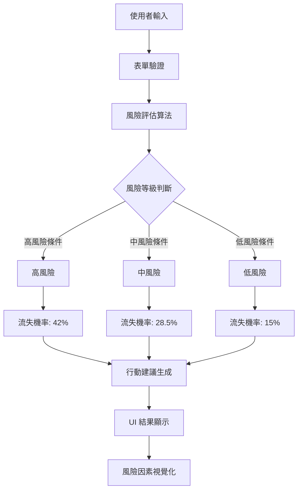

# 茶言觀色·客戶流失風險評估器 - 開發計劃

## 專案概述
根據 PRD.md 重新開發茶飲店客戶流失風險評估工具，取代現有的備份系統儀表板。

## 當前狀態分析
- `index.html`: 目前是備份系統儀表板，需要完全重寫
- `style.css`: 空檔案，需要創建完整樣式
- `script.js`: 空檔案，需要實現風險評估邏輯
- `PRD.md`: 完整的需求文件，已分析完成
- `README.md`: 空檔案，需要更新

## 技術架構
- **前端技術**: HTML5, CSS3, Vanilla JavaScript
- **響應式設計**: 支援桌面、平板、手機
- **字體**: Noto Sans TC (思源黑體) + Roboto
- **圖標**: Font Awesome 6.4.0
- **顏色方案**: 茶綠色 (#6B8E23) 為主色調

## 檔案結構
```
tea-risk-tool/
├── index.html          # 主頁面 (需要重寫)
├── style.css           # 樣式表 (需要創建)
├── script.js           # JavaScript 邏輯 (需要創建)
├── PRD.md              # 產品需求文件 (已存在)
├── README.md           # 專案說明 (需要更新)
└── plan.md             # 開發計劃 (本文件)
```

## HTML 結構設計
已設計完整的 HTML 結構，包含：
1. **標頭區**: 標題、副標題、描述
2. **輸入區**: 四個表單欄位 (年齡、每月到訪次數、最近到訪天數、滿意度評分)
3. **結果區**: 風險等級、流失機率、行動建議、風險因素分析
4. **資訊區**: 評估規則說明
5. **頁尾**: 版本資訊和免責聲明

## CSS 樣式需求
需要實現以下樣式：
1. **全局樣式**: 字體、顏色、間距、響應式斷點
2. **組件樣式**: 表單輸入、按鈕、卡片、風險指示器
3. **顏色變數**: 
   - 主色調: 茶綠色 (#6B8E23)
   - 低風險: 淺綠色 (#90EE90)
   - 中風險: 淺黃色 (#FFFACD)
   - 高風險: 淺紅色 (#FFB6C1)
4. **動畫效果**: 淡入、顏色過渡、數字計數

## JavaScript 功能需求
需要實現以下功能：
1. **表單處理**: 輸入驗證、滑桿同步、星級評分
2. **風險評估算法**: 根據 PRD 規則計算風險等級和流失機率
3. **結果更新**: 動態更新 UI 顯示結果
4. **互動功能**: 重設按鈕、即時計算

## 風險評估算法規則
根據 PRD.md 第4章：

### 高風險條件 (符合任一項)
1. 最近到訪天數 > 60天 (流失率: 45.2%)
2. 滿意度 ≤ 2分 (流失率: 42.9%)
3. 每月到訪次數 ≤ 3次 (流失率: 38.7%)

### 中風險條件 (不符合高風險，且符合任一項)
1. 最近到訪天數 30-60天
2. 滿意度 = 3分
3. 每月到訪次數 4-6次

### 低風險條件 (需同時滿足所有條件)
1. 最近到訪天數 < 30天
2. 滿意度 ≥ 4分
3. 每月到訪次數 ≥ 7次

### 流失機率估算
- 高風險: ~42%
- 中風險: ~28.5%
- 低風險: ~15%

## 測試計劃
1. 功能測試: 驗證所有輸入組合的計算結果
2. 邊界測試: 測試最小/最大值輸入
3. 響應式測試: 在不同設備尺寸測試顯示
4. 使用者體驗測試: 驗證互動流程

## 下一步行動
需要切換到 Code 模式來實現：
1. 重寫 `index.html` 檔案
2. 創建 `style.css` 樣式表
3. 實現 `script.js` 邏輯
4. 更新 `README.md` 文件

## Mermaid 系統架構圖



## 開發優先級
1. 基礎 HTML 結構和 CSS 樣式
2. JavaScript 核心算法實現
3. 互動功能和動畫效果
4. 響應式設計優化
5. 文檔和測試